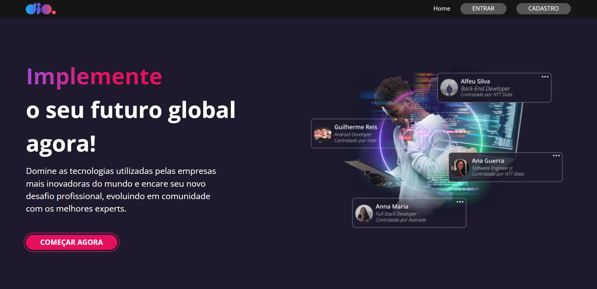

# Dio Clone

Projeto Desenvolvido em React.Js como DESAFIO da DIO no BootCamp dá OrangeTech+, ministrado pelo o Professor Pablo Henrique, o desafio foi criar a page de Cadastro mas, como não dei Fork no Repo base, criei tudo do 0 em questão de styles e estruturação. Na questão das functions, re-utilizei às do Professor, já que até o momento não tive contato com o Hook Forms.

##### Template Base: https://www.figma.com/file/fvjQQNtqaUdpuNixvCZVav/DIO-CLONE?t=nLDmeZn9hTG041OC-0

##### Repositório Base: https://github.com/digitalinnovationone/trilha-react-desafio-3

## O que foi Utilizado:
* HTML
* Styled-Components (CSS-in-Js)
* JavaScript
* React.Js

## Implementações Feitas:
* Page de Cadastro.
* Disabled Button, que fica ativado quando põe às informações.
* Responsividade

#### Deploy: https://dio-csome7.vercel.app/

##### Meu LinkeDin: 

PS: Caso queira ir na page de <strong>Feed</strong>, só por <strong>/feed</strong> no navegador ou logar na page de login, já que o Cadastro <strong>não funciona</strong> XD, põe <strong>pablo@email.com</strong> senha: <strong>123456</strong>
